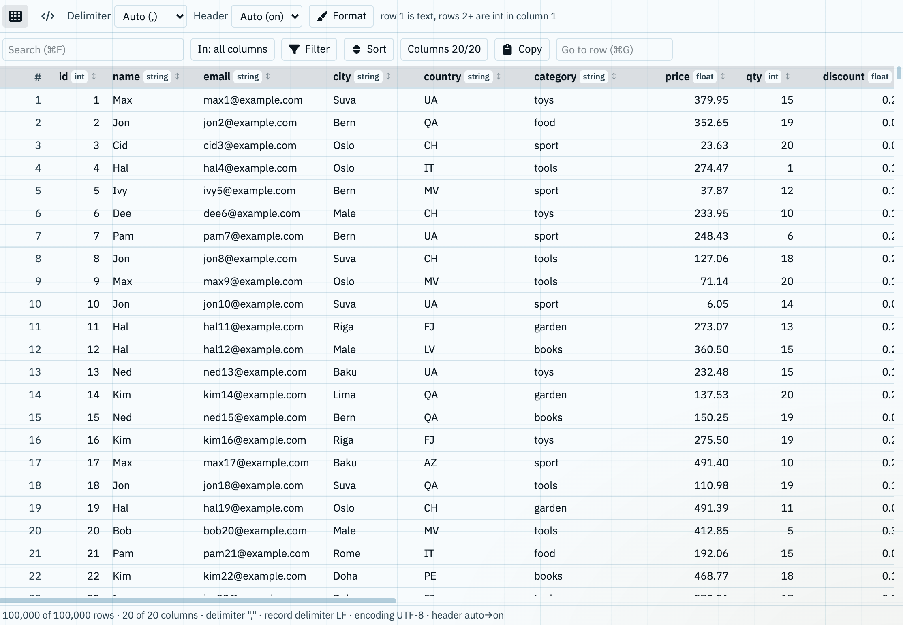

# DSV Table — a bb plugin

Opens CSV, TSV, and other delimited files as a typed, searchable, filterable grid.



The image shows a synthetic sample file: 100,000 rows × 20 columns, 15 MB. The names, cities, and `@example.com` emails are not real.

## Features

- **File types:** `.csv`, `.tsv`, `.tab`, `.psv`, `.dsv`, `.ssv`. The file opens in the "Table" viewer.
- **Grid and Code views.** Grid is the table. Code shows the raw text in bb's source viewer.
- **Large files.** Only the rows on screen are in the page. With the 100,000-row sample, the first paint took 297–833 ms, and a search or filter change took 114 ms or less (bb web UI, headless Chrome).
- **Delimiter:** detected from `,` tab `;` `|`. You can also pick one, or type any single character.
- **Header row:** Auto, On, or Off. Auto shows its reason, for example "row 1 is text, rows 2+ are int in column 1".
- **Typed columns:** int, float, bool, date, or string, inferred from the first 1,000 rows. Numbers align right.
- **Format:** encoding (12 choices, UTF-8 by default), text qualifier (`"`, `'`, none), decimal symbol (Auto, `.`, `,`), and date order (Auto, DMY, MDY, YMD).
- **Search** in all columns, or only in the columns you pick. Case is ignored.
- **Filters:** add as many as you need. A row must match all of them. The operators follow the column type.
- **Sort:** click the arrow in a column name for ascending, descending, then off. Shift+click adds a column as the next sort level. The Sort panel sets the levels and their order.
- **Columns:** show or hide each column. Drag a column edge to resize it. Double-click the edge to fit the column to its content: the longest values in the rows you see, and the column name.
- **Select and copy, as in a spreadsheet:** cells, rows, or columns. Copy gives tab-separated text, with or without the column names.
- **Save:** downloads the rows you see (search, filters, and sort applied) and the shown columns as a UTF-8 CSV file.
- **Viewer:** a pane on the right of the grid. The Cell tab shows the whole value of the active cell, with its line breaks and character count. The Record tab shows the active row, one line per column. Its First, Previous, Next, and Last buttons move through the rows you see.
- **Go to row:** moves a row number to the top, marks it, and makes it the active row.

## Keys

In Grid view. ⌘F, ⌘G, and ⌘S work anywhere in the plugin. The other keys work after you click a cell.

| Key | Action |
|---|---|
| ⌘F / Ctrl+F | Focus Search |
| ⌘G / Ctrl+G | Focus Go to row |
| ⌘S / Ctrl+S | Save the rows you see as a CSV file |
| Arrows / Shift+arrows | Move the active cell / extend the selection |
| ⌘A / Ctrl+A | Select all |
| ⌘C / Ctrl+C | Copy the selection |
| Esc | Clear the selection |
| Shift+click a sort arrow | Add the column as a sort level; again: descending; again: remove it |

## Requirements

- bb 0.42 or later
- bb plugin SDK 0.4.47 or later

## Install

```sh
git clone https://github.com/laminko/bb-plugin-dsv.git
bb plugin build ./bb-plugin-dsv
bb plugin install "$PWD/bb-plugin-dsv" --yes
```

The build needs no `npm install`. `--yes` skips bb's confirmation. Plugins run as full-trust code inside the bb server.

## Develop

```sh
npm install                # dev dependencies: plugin SDK, React types, TypeScript
npm test                   # node --test logic.test.ts
npx tsc -p tsconfig.json   # type check
bb plugin reload dsv       # rebuild and reload the installed plugin
```

`npm test` uses Node's built-in TypeScript support (tested with Node 24.18). `logic.ts` holds the parser, detection, filters, sort, and copy logic, with no DOM. `app.tsx` is the viewer. `server.ts` does nothing.

## Limits

- Read only: no editing and no saving.
- The file loads once. It does not reload when the file changes on disk.
- Filters combine with AND only. No regular expressions.
- Save writes a new CSV download. It does not change the original file.
- Sort, column widths, hidden columns, and the Viewer pane reset when the tab closes.
- `NA`, `null`, and thousands separators stay text. Time-zone offsets in dates are ignored.
- The encoding is not detected. Pick it in Format.

## Credits

Icons: [Font Awesome Free](https://fontawesome.com) 6.7.2 by Fonticons, Inc., licensed CC BY 4.0.
